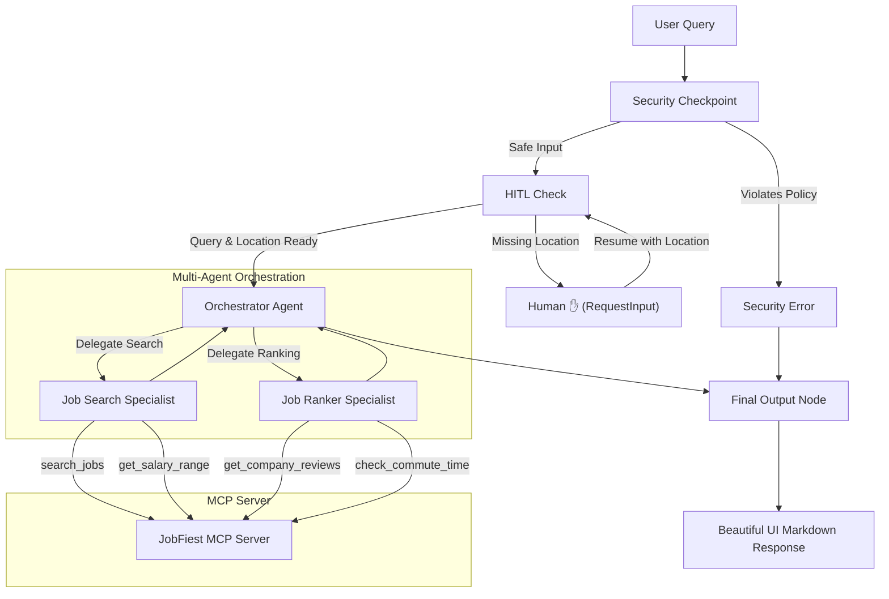

# Submission Write-Up — JobFiest

## Problem Statement
Finding job postings that truly fit a candidate's profile can be time-consuming. Traditional platforms return thousands of generic results and require candidates to manually cross-reference salaries, commute times, and company ratings. JobFiest solves this by acting as an AI-powered concierge job finder that automates search and curation. It dynamically checks salaries, ratings, and commute times, and scores each job based on candidate preferences—all through an interactive, secure, and user-centric multi-agent workflow.

---

## Solution Architecture

---

## Concepts Used

1. **ADK 2.0 Workflow**: Built using the graph-based Workflow API in [agent.py](file:///d:/adk-workspace/jobfiest/app/agent.py#L226-L242), defining nodes (`security_checkpoint`, `hitl_check`, `orchestrator_agent`, `final_output`, `security_error`) and routing.
2. **LlmAgent**: Defines distinct intelligent roles (`orchestrator_agent`, `job_search_agent`, `job_ranker_agent`) in [agent.py](file:///d:/adk-workspace/jobfiest/app/agent.py#L60-L105).
3. **AgentTool**: Enables orchestrator-to-sub-agent delegation in [agent.py](file:///d:/adk-workspace/jobfiest/app/agent.py#L102), making the sub-agents accessible to the orchestrator as tools.
4. **Model Context Protocol (MCP) Server**: Custom stdio server implemented in [mcp_server.py](file:///d:/adk-workspace/jobfiest/app/mcp_server.py) providing real-world capabilities.
5. **Security Checkpoint**: Implemented in [agent.py](file:///d:/adk-workspace/jobfiest/app/agent.py#L108-L168) as a gateway routing node checking for injections, policy issues, and scrubbing PII.
6. **Agents CLI**: Project created, managed, and run via the `agents-cli` tool suite.

---

## Security Design

JobFiest implements a multi-layered security checkpoint:
* **PII Redaction**: Any email addresses or phone numbers are scrubbed using regular expressions before they are stored or processed by down-stream LLMs.
* **Prompt Injection Detection**: Blocks attacks (e.g., attempts to bypass system prompts or override instructions) using keyword checks, raising a CRITICAL audit log event and routing to an error page.
* **Domain Content Policy**: Restricts searches to professional, legal industries, blocking inappropriate keywords (e.g. `exploit`, `hacker`) with a WARNING log event.
* **Structured Audit Logging**: Standard JSON-formatted security logs write event metadata with appropriate severity levels (`INFO`, `WARNING`, `CRITICAL`), ensuring ease of compliance and threat hunting.

---

## MCP Server Design

The Model Context Protocol (MCP) server ([mcp_server.py](file:///d:/adk-workspace/jobfiest/app/mcp_server.py)) exposes four specialised tools:
* `search_jobs`: Simulates checking a database of active job listings matching keywords and location filters.
* `get_salary_range`: Provides local salary benchmarks for specific titles and applies location multipliers.
* `get_company_reviews`: Fetches employee reviews and overall ratings to assess company culture.
* `check_commute_time`: Calculates estimated daily travel times and distance between candidate location and destination office.

---

## Human-in-the-Loop (HITL) Flow

A key concierge feature is the Location Check. If a user queries *"Software Engineer"* without specifying where, it is bad practice to guess. JobFiest triggers a HITL state:
1. `hitl_check` yields a `RequestInput` with the ID `ask_location` and pauses execution.
2. The ADK web interface displays a text prompt for the user.
3. Once the user replies, the workflow resumes, saving the choice to the state and passing the complete payload to the orchestrator.

---

## Demo Walkthrough

The project includes three complete walkthrough scenarios (documented in the README and Narration Script):
1. **Scenario 1: Happy Path with Location Pause**: Demonstrates the HITL location prompt, sub-agent coordination, and MCP tool execution.
2. **Scenario 2: Quick Search (Bypass HITL)**: Shows immediate search when location is already provided in the original query (e.g., "Data Scientist in New York").
3. **Scenario 3: Injection Block**: Demonstrates the prompt injection detector catching malicious payload and returning a clean security rejection card.

---

## Impact & Value Statement

JobFiest transforms the job hunt from a manual, multi-tab search process into a conversational, curated experience.
* **For Candidates**: Saves hours of research by combining job search, company rating, commute distance, and salary comparison in a single action.
* **For Employers**: Reduces friction for applicants, helping them find matched postings, culture evaluations, and realistic salary expectations in real-time.
* **For Developers**: Showcases how a secure, multi-agent graph with local tool extensions (MCP) can handle sensitive user criteria without data leaks.
